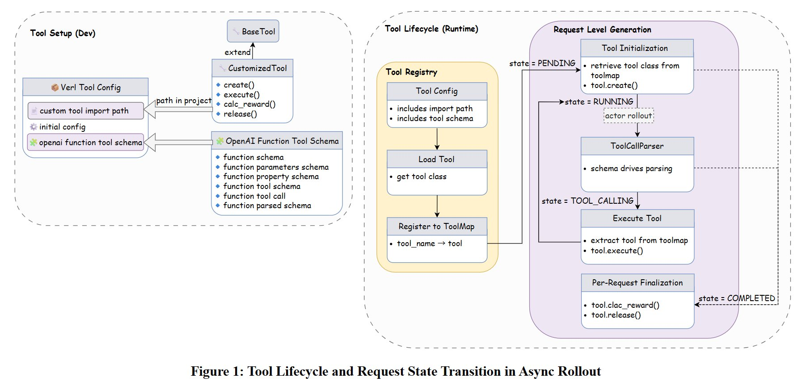
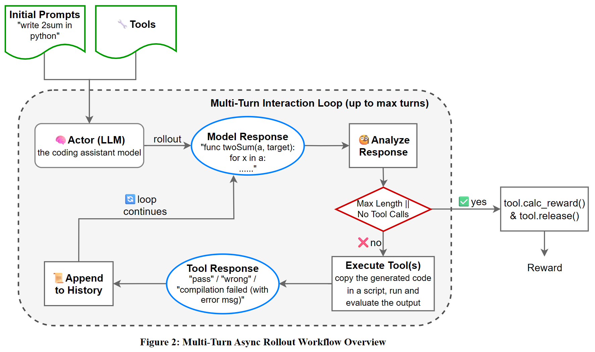

## 示例

[gsm8k_tool_config.yaml
](https://github.com/volcengine/verl/blob/main/examples/sglang_multiturn/config/tool_config/gsm8k_tool_config.yaml)

## 工具交互过程

1. 使用 `generate_sequences_with_tools` 预处理，将可用工具集合与该样本的 `tools_kwargs` 字段取交集，挑选出该样本真正需要调用的工具，嵌入 prompt 模板中，并以 message list 的形式组织，供后续推理使用。
2. LLM 基于 schema 生成包含结构化函数调用（工具调用）的响应。
3. `AsyncSGLangRollout` 使用 `FunctionCallParser` 检测并从输出中提取工具调用。
4. 推理引擎使用解析后的参数调用 `tool.execute()`。
5. 工具可能：
   - 返回文本工具响应，该响应将以 tool 角色附加到消息历史中。
   - 返回单步奖励和工具指标，可用于计算最终奖励和监控工具性能。
6. 更新工具内部的状态。
7. 引擎将工具响应附加到消息历史中，并继续对话。
8. 在完整的推理结束后，调用工具的 `calc_reward()` 计算最终奖励。

