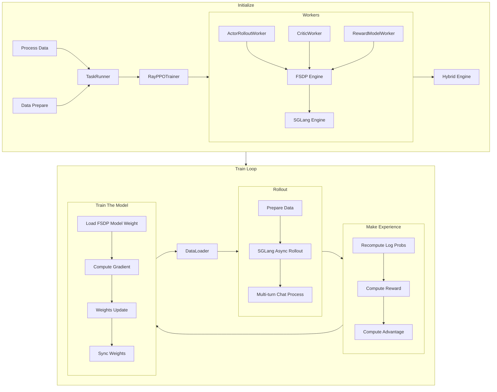

```mermaid
flowchart TB
subgraph W2["Initialize"]
    WP[Process Data] --> A
    D1[Data Prepare] --> A
    A[TaskRunner] --> B1[RayPPOTrainer]
    B1 --> Workers

    subgraph Workers["Workers"]
        WA[ActorRolloutWorker] --> WD[FSDP Engine]
        WB[CriticWorker] --> WD
        WC[RewardModelWorker] --> WD
        WD --> WE[SGLang Engine]
    end

    Workers --> C1[Hybrid Engine]
end 

subgraph W3["Train Loop"]
    E[DataLoader] --> RolloutBox

    subgraph RolloutBox["Rollout"]
        F1[Prepare Data] --> F2[SGLang Async Rollout]
        F2 --> F3[Multi-turn Chat Process]
    end

    RolloutBox --> ExpBox

    subgraph ExpBox["Make Experience"]
        G1[Recompute Log Probs] --> G2[Compute Reward]
        G2 --> G3[Compute Advantage]
    end

    ExpBox --> UpdateBox

    subgraph UpdateBox["Train The Model"]
        H1[Load FSDP Model Weight] --> H2[Compute Gradient]
        H2 --> H3[Weights Update]
        H3 --> H4[Sync Weights]
    end

    UpdateBox --> E
end

W2 --> W3
```